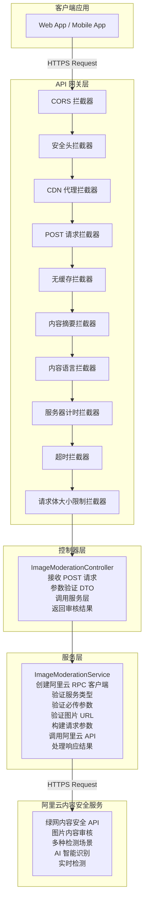
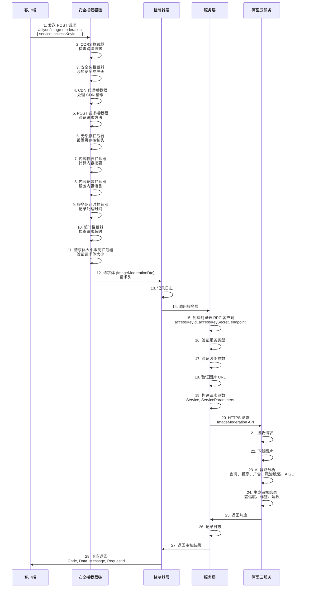
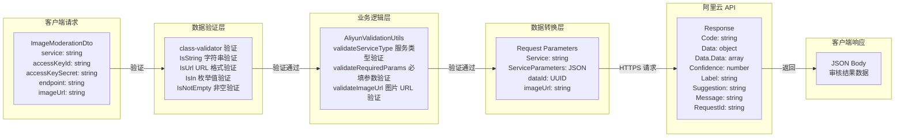
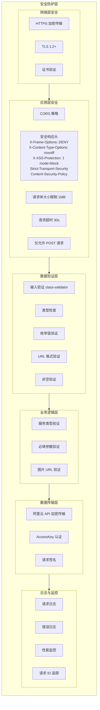

# 图片内容审核 API - `/aliyun/image-moderation`

## 概述

图片内容审核 API 提供基于阿里云内容安全服务的图片审核功能，可以自动检测图片中的色情、暴恐、广告、政治敏感等违规内容。

**端点信息：**
- **URL**: `/aliyun/image-moderation`
- **方法**: `POST`
- **认证**: 需要提供阿里云访问密钥

## 系统架构

### 整体架构图

### 请求处理流程图

### 数据流图

### 安全架构图

## 支持

如有问题或建议，请通过以下方式联系：

- 提交 Issue
- 发送邮件至项目维护者
- 查看项目文档

## 许可证

本项目采用 AGPL-3.0 许可证。