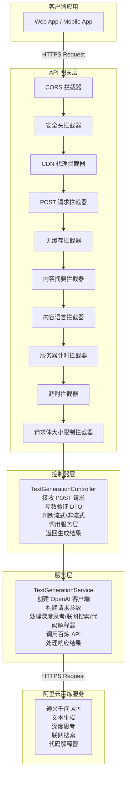
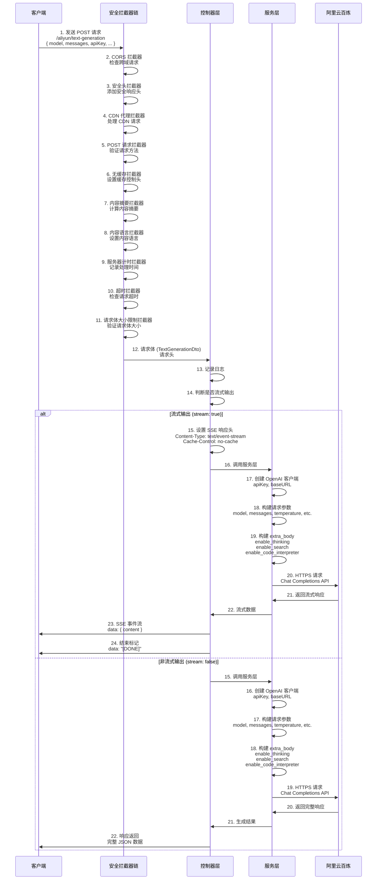
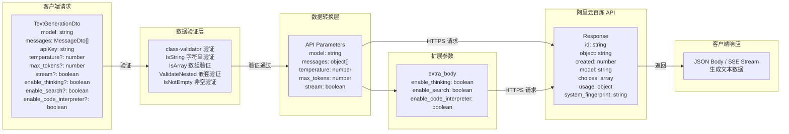

# 百炼文本生成 API - `/aliyun/text-generation`

## 概述

百炼文本生成 API 提供基于阿里云百炼服务的文本生成功能，支持多种通义千问模型，包括深度思考、联网搜索、代码解释器等高级特性。

**端点信息：**
- **URL**: `/aliyun/text-generation`
- **方法**: `POST`
- **认证**: 需要提供阿里云百炼 API Key

## 支持的模型

| 模型名称                   | 说明       |
|------------------------|----------|
| `qwen-plus`            | 通义千问增强版  |
| `qwen-turbo`           | 通义千问快速版  |
| `qwen-max`             | 通义千问旗舰版  |
| `qwen-max-longcontext` | 通义千问长文本版 |

## 系统架构

### 整体架构图



### 请求处理流程图



### 数据流图



## 请求参数

### TextGenerationDto

| 参数名                       | 类型           | 必填 | 说明            | 默认值                                                 |
|---------------------------|--------------|----|---------------|-----------------------------------------------------|
| `model`                   | string       | 是  | 模型名称          | -                                                   |
| `messages`                | MessageDto[] | 是  | 消息列表          | -                                                   |
| `apiKey`                  | string       | 是  | 阿里云百炼 API Key | -                                                   |
| `baseURL`                 | string       | 否  | 基础 URL        | `https://dashscope.aliyuncs.com/compatible-mode/v1` |
| `temperature`             | number       | 否  | 温度参数 (0-2)    | 0.7                                                 |
| `max_tokens`              | number       | 否  | 最大生成 token 数  | 2048                                                |
| `top_p`                   | number       | 否  | 采样策略 (0-1)    | 0.8                                                 |
| `stream`                  | boolean      | 否  | 是否使用流式输出      | false                                               |
| `enable_thinking`         | boolean      | 否  | 是否启用深度思考模式    | false                                               |
| `enable_search`           | boolean      | 否  | 是否启用联网搜索      | false                                               |
| `enable_code_interpreter` | boolean      | 否  | 是否启用代码解释器     | false                                               |
| `stream_options`          | object       | 否  | 流式输出选项        | -                                                   |
| `response_format`         | object       | 否  | 响应格式          | -                                                   |

### MessageDto

| 参数名       | 类型          | 必填 | 说明                           | 默认值   |
|-----------|-------------|----|------------------------------|-------|
| `role`    | MessageRole | 是  | 消息角色 (system/user/assistant) | -     |
| `content` | string      | 是  | 消息内容                         | -     |
| `partial` | boolean     | 否  | 是否为部分补全                      | false |

### MessageRole

| 值           | 说明   |
|-------------|------|
| `system`    | 系统角色 |
| `user`      | 用户角色 |
| `assistant` | 助手角色 |

## 响应格式

### 非流式响应

```json
{
  "id": "chatcmpl-xxx",
  "object": "chat.completion",
  "created": 1234567890,
  "model": "qwen-plus",
  "choices": [
    {
      "index": 0,
      "message": {
        "role": "assistant",
        "content": "生成的文本内容"
      },
      "finish_reason": "stop"
    }
  ],
  "usage": {
    "prompt_tokens": 10,
    "completion_tokens": 20,
    "total_tokens": 30
  },
  "system_fingerprint": "fp_xxx"
}
```

### 流式响应

SSE 事件流格式：

```
data: {"content":"生成的文本内容片段1"}

data: {"content":"生成的文本内容片段2"}

data: "[DONE]"
```

## 高级特性

### 深度思考模式 (`enable_thinking`)

当启用深度思考模式时，模型会在思考后回复，适用于需要复杂推理的场景。

**注意：** 
- 深度思考模式仅支持 `qwen-max` 系列
- 启用后会增加响应时间和 token 消耗

### 联网搜索 (`enable_search`)

启用联网搜索后，模型将判断用户问题是否需要联网查询：
- 若需要，则结合搜索结果回答
- 若不需要，则直接使用模型自身知识回答

### 代码解释器 (`enable_code_interpreter`)

启用后，模型可以执行代码来回答问题。

**注意：**
- 代码解释器功能仅支持思考模式调用
- 代码解释器功能仅支持流式输出调用

### JSON 输出 (`response_format`)

支持两种 JSON 输出格式：

1. **json_object** - 简单 JSON 对象输出
2. **json_schema** - 带有 schema 验证的 JSON 输出

示例：

```json
{
  "response_format": {
    "type": "json_schema",
    "json_schema": {
      "name": "weather",
      "description": "天气信息",
      "strict": true,
      "schema": {
        "type": "object",
        "properties": {
          "city": { "type": "string" },
          "temperature": { "type": "number" },
          "condition": { "type": "string" }
        },
        "required": ["city", "temperature", "condition"]
      }
    }
  }
}
```

## 支持与联系

如有问题或建议，请通过以下方式联系：

- 提交 Issue
- 发送邮件至项目维护者
- 查看项目文档

## 许可证

本项目采用 AGPL-3.0 许可证。